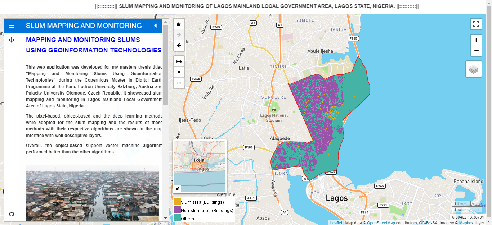
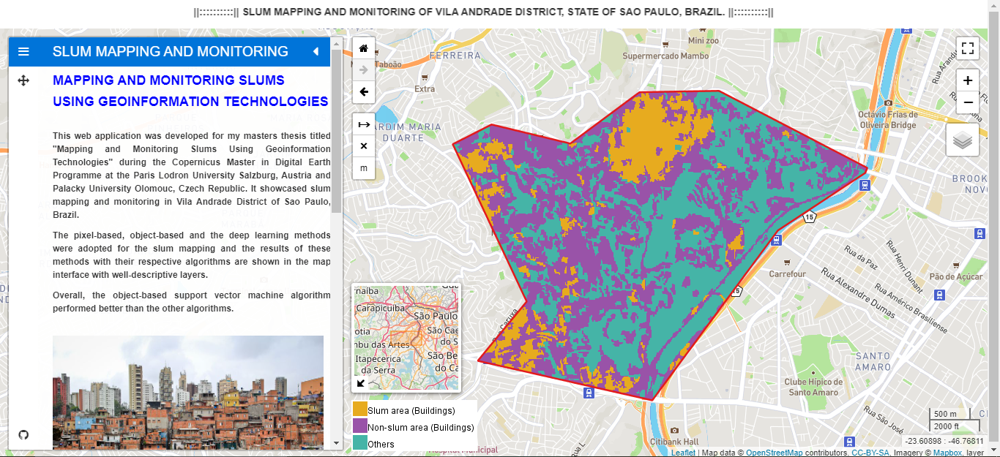

# [Mapping-and-Monitoring-Slums-using-Geoinformation-Technologies](https://github.com/Sheriff-Jimoh/Mapping-and-Monitoring-Slums-using-Geoinformation-Technologies)

This is the repository created for my master thesis during the [Copernicus Master in Digital Earth Programme](http://www.master-cde.eu/) at the [Department of Geoinformatics](https://zgis.at/), [Paris Lodron University Salzburg](https://www.plus.ac.at/?lang=en), Austria and [Department of Geoinformatics](http://www.geoinformatics.upol.cz/), [Palacky University Olomouc](https://www.upol.cz/), Czech Republic.
It showcased slum mapping and monitoring in Lagos Mainland Local Government Area of Lagos State, Nigeria and Vila Andrade District of Sao Paulo, Brazil.

  

  

For more information email me at sherobranding@gmail.com.

